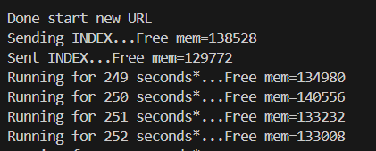
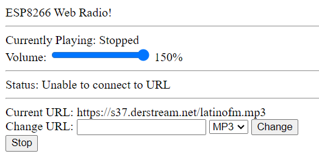

# PRACTICA 7 :  Buses de comunicación III (I2S)  

El objetivo de la practica actual es describir el funcionamiento del bus I2S y realizar una practica para comprender su  funcionamiento 

Alumna: **Àfrica Abad**


## Ejercicio Practico 2  reproducir un archivo WAVE en ESP32 desde una tarjeta SD externa

Queremos reproducir el archivo WAVE que mencioné al principio de este tutorial a través del ESP32 NodeMCU y el altavoz. Debido a que el ESP32 tiene que leer el archivo WAVE y reenviar la señal de audio digital al MAX98357A, tenemos que usar una tarjeta SD con el archivo WAVE. También puede utilizar un archivo MP3 en lugar del archivo WAVE.

La siguiente imagen muestra el cableado del ESP32 NodeMCU con el módulo de tarjeta (Micro) SD, el MAX98357A y el altavoz. 


1. Descibir la salida por el puerto serie 




2. Explicar el funcionamiento

-**Inclusión de librerías**

  ```cpp
  #include <Arduino.h>
  #include <WiFi.h>   //gestión de la conexión 
  
  //librerias relacionadas con la reproducción de audio. Proporcionan funcionalidades para leer y decodificar archivos de audio en formatos específicos (MP3 y AAC) y para enviar el audio decodificado a través de una salida de audio (I2S).
  #include "AudioFileSourceICYStream.h"
  #include "AudioFileSourceBuffer.h"
  #include "AudioGeneratorMP3.h"
  #include "AudioGeneratorAAC.h"
  #include "AudioOutputI2S.h"


  #include <EEPROM.h>     //  proporciona funciones para leer y escribir en la memoria EEPROM del ESP32.

  #include "web.h"   //proporciona funcionalidades para crear un servidor web y manejar solicitudes HTTP entrantes. 
  ```

-**Definiciones y variables globales**  

-**Funciones de gestión de solicitudes HTTP**: se definen funciones para manejar diferentes tipos de solicitudes HTTP, como obtener el estado (`HandleStatus`), el título de la canción (`HandleTitle`), cambiar la URL de la radio (`HandleChangeURL`), etc.

- **`setup`**: configura la conexión WiFi, inicia el servidor web y  inicializa variables.

- **`loop`**: se ejecuta repetidamente, manejando solicitudes HTTP entrantes y controlando la reproducción de audio.


- **Funciones de control de reproducción de audio**: 

    `StartNewURL`: inicia nueva URL de radio.

    `StopPlaying`: detiene la reproducción.

    `PumpDecoder`: bombea datos al decodificar el audio.


- **Funciones de gestión de configuración `loadSettings()` , `saveSettings()`**: cargan y guardan la configuración de la radio (URL, tipo de audio, volumen) en la EEPROM del ESP32, lo que permite que la radio recuerde la configuración incluso después de reiniciar.

- **Manejo de solicitudes HTTP en el bucle principal `loop()`**: , el programa maneja las solicitudes HTTP entrantes y llama a las funciones correspondientes para responder a ellas.

3. Montaje


4. Web



Desde la web se puede controlar la reproducción de radio por Internet, cambiar de estación, ajustar el volumen y obtener información sobre la canción actual.

